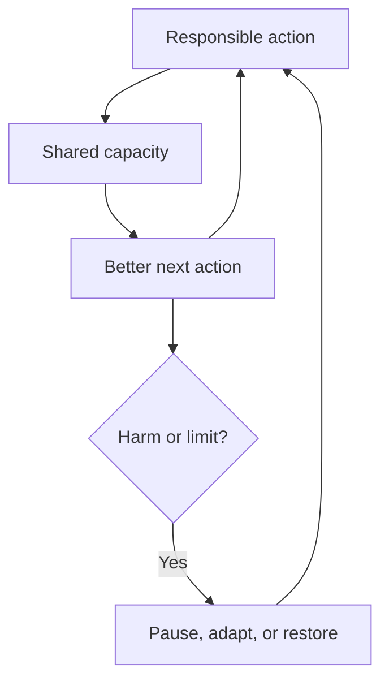

# Regenerative Skills Standard

Version 1.0 — design review standard

This standard defines the stricter **Regenerative core** inside Awesome ChatGPT Skills. The wider catalog maps useful work in the ecosystem; only entries carrying the `Regenerative core` and `Design reviewed` labels have passed every gate below.

It is a design standard, not proof that a real-world outcome has already occurred. Field evidence is a separate status.

[Leia em português](REGENERATIVE_STANDARD.pt-BR.md)

## Purpose

A regenerative skill should improve the capacity of a human system to care, connect, learn, adapt, and renew its resource base. Local efficiency is insufficient when it moves cost, risk, attention, or waste elsewhere.

The standard is pass/fail. Scores are not added together because a high result in one lens must not purchase permission to cause serious harm in another.

## The five lenses

| Lens | Question | Example indicators |
|---|---|---|
| Human | Does it increase agency, safety, accessibility, health, or useful capability? | independent task completion, avoidable burden, safety events, comprehension |
| Social | Does it strengthen trust, reciprocity, inclusion, fair power, or coordination? | closed commitments, participation gaps, relationship diversity, recurrence of conflict |
| Knowledge | Does it create findable, understandable, governed, reusable learning? | verified comprehension, successful reuse, provenance, corrections, expiry coverage |
| Resources | Does it reduce waste and renew time, attention, money, data, materials, energy, or water? | use versus baseline by unit, maintenance load, recovery rate, restored capacity |
| Ecology | Does it reduce pressure on living systems or restore ecological function? | energy, water, emissions, toxicity, habitat, soil, biodiversity, locally relevant thresholds |

Not every skill can materially improve every lens. It must show a credible mechanism and observable indicator in at least three, inspect all five, and assign an owner and mitigation to every material risk.

## Mandatory gates

1. **Real work** — it solves a bounded, repeatable task and has a discriminating trigger.
2. **System boundary** — it identifies affected people, maintainers, non-users, future effects, the living environment, the time horizon, and what remains outside the analysis.
3. **Three-lens mechanism** — at least three lenses contain both a causal mechanism and an observable indicator. Aspirations do not count.
4. **No unowned material harm** — tradeoffs in all five lenses are checked. A material risk needs an owner, mitigation, stop condition, or an explicit decision not to proceed.
5. **Two-loop design** — it contains one reinforcing loop that can compound benefit and one balancing safeguard that limits capture, rebound, overload, exclusion, or instability.
6. **Regenerative seed** — completing the workflow leaves at least one renewable asset: capability, relationship, governed knowledge, repairable infrastructure, restored resource, or evidence that makes the next cycle safer and easier.
7. **Resource ledger** — attention, time, money, compute, data, materials, energy, and water are tracked when material. The design must keep each material use within a declared budget and leave at least one named resource or capacity above its baseline. Unlike units remain separate; a gain in one cannot silently offset a deficit in another, and avoided harm is not mislabeled as restoration. The outcome remains a hypothesis until measured.
8. **Plain first, precise underneath** — the result starts in everyday language, defines necessary technical terms, preserves uncertainty and caveats, and includes a comprehension check when decisions depend on understanding.
9. **Evidence honesty** — expected benefits are hypotheses. Sources, assumptions, unknowns, review dates, and disconfirming evidence remain visible.
10. **Safe agency** — consent, privacy, authorization, reversibility, escalation, and professional boundaries match the risk.

Failure on any gate means the entry does not receive the regenerative label. It may still be useful elsewhere in the catalog.

## The required loop

Examples of balancing safeguards include workload caps, consent renewal, resource budgets, minority protections, rollback triggers, ecological thresholds, expiry rules, and independent review.

## Review record

Every core catalog entry contains a machine-checked `systemic_review` record:

- `status`: `design-reviewed` or, in the future, `field-tested`;
- `lenses`: three to five mechanisms paired with indicators;
- `harm_check`: the review of material effects across all five lenses;
- `reinforcing_loop` and `balancing_safeguard`;
- `regenerative_seed`;
- `resource_ledger`: tracked resource types, baseline comparison, and restoration commitment;
- `plain_language`: summary-first, technical-layer, and comprehension-check requirements.

The validator also requires all five lenses across the portfolio and ecology in at least two core skills. This portfolio rule prevents an apparently systemic collection from silently excluding the living world.

## Evidence levels

| Status | Meaning | Minimum evidence |
|---|---|---|
| Design reviewed | The instructions pass every design gate and validation check. | inspectable skill, review record, safety boundaries, indicators, and sources |
| Field tested | A future status; the workflow has been used and reviewed without hiding contrary results. | dated baseline and results, context, method, participant feedback, resource ledger, harms, limitations, and reusable evidence |

The first release uses only `Design reviewed`. Field testing should begin with small, reversible cases; it should not be awarded from testimonials or self-reported success alone.

## Foundations

This standard adapts systems and sustainability guidance rather than claiming a new scientific metric. Its foundations include the W3C Web Sustainability Guidelines; UNDRR's resilience terminology; OECD guidance on meaningful participation and closing the feedback loop; FAIR and CARE principles for reusable, collectively governed knowledge; community engagement guidance from WHO; and small-cycle improvement methods from the Institute for Healthcare Improvement.

- <https://www.w3.org/TR/web-sustainability-guidelines/>
- <https://www.undrr.org/terminology/resilience>
- <https://www.oecd.org/en/publications/oecd-guidelines-for-citizen-participation-processes_f765caf6-en.html>
- <https://www.gofair.foundation/fair-principles>
- <https://www.gida-global.org/careprinciples>
- <https://www.who.int/teams/integrated-health-services/quality-of-care/community-engagement>
- <https://www.ihi.org/library/topics/model-for-improvement>
