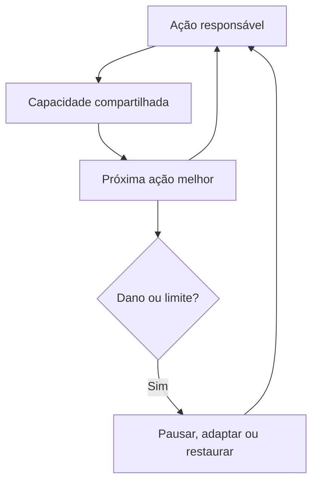

# Padrão de Skills Regenerativas

Versão 1.0 — padrão de revisão de projeto

Este padrão define o núcleo mais rigoroso **Núcleo regenerativo** do Awesome ChatGPT Skills. O catálogo amplo mapeia trabalhos úteis do ecossistema; apenas as entradas com os selos `Núcleo regenerativo` e `Projeto revisado` passaram por todos os critérios abaixo.

É um padrão de projeto, não uma prova de que um resultado já aconteceu no mundo real. Evidência de campo corresponde a outro status.

[Read in English](REGENERATIVE_STANDARD.md)

## Propósito

Uma skill regenerativa deve ampliar a capacidade de um sistema humano de cuidar, conectar, aprender, adaptar-se e renovar sua base de recursos. Eficiência local não basta quando transfere custo, risco, atenção ou resíduos para outro lugar.

O padrão é eliminatório. Não somamos pontos porque um ótimo resultado em uma área não compra licença para causar dano grave em outra.

## As cinco áreas

| Área | Pergunta | Exemplos de indicadores |
|---|---|---|
| Humana | Aumenta autonomia, segurança, acessibilidade, saúde ou capacidade útil? | tarefa concluída sem ajuda, carga evitável, eventos de segurança, compreensão |
| Social | Fortalece confiança, reciprocidade, inclusão, poder justo ou coordenação? | compromissos fechados, lacunas de participação, diversidade de relações, recorrência de conflito |
| Conhecimento | Cria aprendizagem localizável, compreensível, governada e reutilizável? | compreensão verificada, reúso bem-sucedido, proveniência, correções, cobertura de validade |
| Recursos | Reduz desperdício e renova tempo, atenção, dinheiro, dados, materiais, energia ou água? | uso contra linha de base por unidade, carga de manutenção, recuperação, capacidade restaurada |
| Ecologia | Reduz pressão sobre sistemas vivos ou restaura sua função? | energia, água, emissões, toxicidade, habitat, solo, biodiversidade e limites locais relevantes |

Nem toda skill consegue melhorar materialmente as cinco áreas. Ela precisa mostrar mecanismo e indicador observável em pelo menos três, examinar todas as cinco e atribuir responsável e mitigação a cada risco material.

## Critérios obrigatórios

1. **Trabalho real** — resolve uma tarefa delimitada e repetível, com gatilho discriminante.
2. **Fronteira do sistema** — identifica pessoas afetadas, mantenedores, não usuários, efeitos futuros, ambiente vivo, horizonte de tempo e o que ficou fora da análise.
3. **Mecanismo em três áreas** — pelo menos três áreas apresentam mecanismo causal e indicador observável. Intenções não contam.
4. **Nenhum dano material sem responsável** — os impactos nas cinco áreas são examinados. Um risco material exige responsável, mitigação, condição de parada ou decisão explícita de não prosseguir.
5. **Dois ciclos** — contém um ciclo de reforço capaz de acumular benefício e uma salvaguarda de equilíbrio contra captura, efeito rebote, sobrecarga, exclusão ou instabilidade.
6. **Semente regenerativa** — o fluxo deixa pelo menos um ativo renovável: capacidade, relação, conhecimento governado, infraestrutura reparável, recurso restaurado ou evidência que torne o próximo ciclo mais seguro e fácil.
7. **Balanço de recursos** — atenção, tempo, dinheiro, computação, dados, materiais, energia e água são acompanhados quando relevantes. O projeto precisa manter cada uso material dentro de um limite declarado e deixar pelo menos um recurso ou capacidade nomeada acima da linha de base. Unidades diferentes permanecem separadas; o ganho em uma não compensa silenciosamente o déficit em outra, e dano evitado não é chamado de restauração. O resultado continua sendo hipótese até ser medido.
8. **Simples primeiro, precisão abaixo** — o resultado começa em linguagem cotidiana, define termos técnicos necessários, preserva incertezas e ressalvas e verifica a compreensão quando uma decisão depende dela.
9. **Honestidade de evidência** — benefícios esperados são hipóteses. Fontes, premissas, incógnitas, datas de revisão e evidências contrárias continuam visíveis.
10. **Autonomia segura** — consentimento, privacidade, autorização, reversibilidade, escalonamento e limites profissionais correspondem ao risco.

Falhar em qualquer critério impede o selo regenerativo. A skill ainda pode ser útil em outra parte do catálogo.

## O ciclo exigido

Exemplos de salvaguardas: limites de carga, renovação de consentimento, orçamento de recursos, proteção de minorias, gatilhos de reversão, limites ecológicos, regras de validade e revisão independente.

## Registro de revisão

Cada entrada do núcleo contém um registro `systemic_review` validado por máquina:

- `status`: `design-reviewed` ou, no futuro, `field-tested`;
- `lenses`: de três a cinco mecanismos ligados a indicadores;
- `harm_check`: a verificação dos efeitos materiais nas cinco áreas;
- `reinforcing_loop` e `balancing_safeguard`;
- `regenerative_seed`;
- `resource_ledger`: tipos acompanhados, comparação com linha de base e compromisso de restauração;
- `plain_language`: resumo inicial, camada técnica e verificação de compreensão.

O validador também exige as cinco áreas no conjunto e ecologia em pelo menos duas skills. Essa regra de portfólio impede que uma coleção aparentemente sistêmica exclua silenciosamente o mundo vivo.

## Níveis de evidência

| Status | Significado | Evidência mínima |
|---|---|---|
| Projeto revisado | As instruções passaram por todos os critérios de projeto e validação. | skill inspecionável, registro de revisão, limites de segurança, indicadores e fontes |
| Testada em campo | Status futuro; o fluxo foi usado e revisado sem esconder resultados contrários. | linha de base e resultados datados, contexto, método, retorno de participantes, balanço de recursos, danos, limites e evidência reutilizável |

A primeira versão usa somente `Projeto revisado`. O teste de campo deve começar por casos pequenos e reversíveis; depoimentos ou sucesso autodeclarado não bastam.

## Fundamentos

Este padrão adapta referências de sistemas e sustentabilidade, sem se apresentar como uma nova métrica científica. Entre suas bases estão as Diretrizes de Sustentabilidade Web do W3C; a definição de resiliência da UNDRR; a orientação da OCDE sobre participação significativa e fechamento do ciclo de retorno; os princípios FAIR e CARE para conhecimento reutilizável e governado coletivamente; a orientação da OMS sobre engajamento comunitário; e ciclos pequenos de melhoria do Institute for Healthcare Improvement.

- <https://www.w3.org/TR/web-sustainability-guidelines/>
- <https://www.undrr.org/terminology/resilience>
- <https://www.oecd.org/en/publications/oecd-guidelines-for-citizen-participation-processes_f765caf6-en.html>
- <https://www.gofair.foundation/fair-principles>
- <https://www.gida-global.org/careprinciples>
- <https://www.who.int/teams/integrated-health-services/quality-of-care/community-engagement>
- <https://www.ihi.org/library/topics/model-for-improvement>
